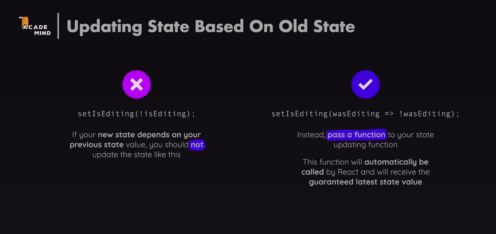
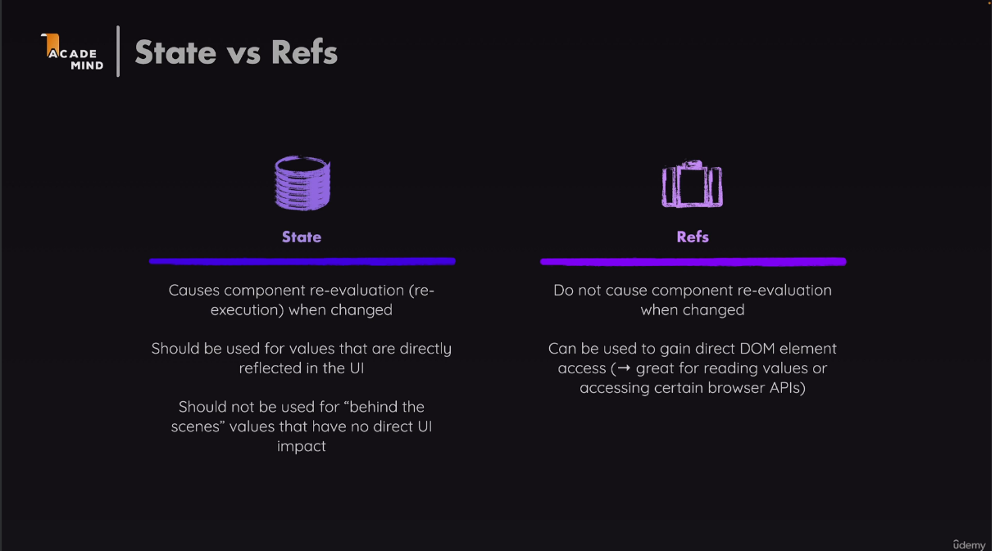
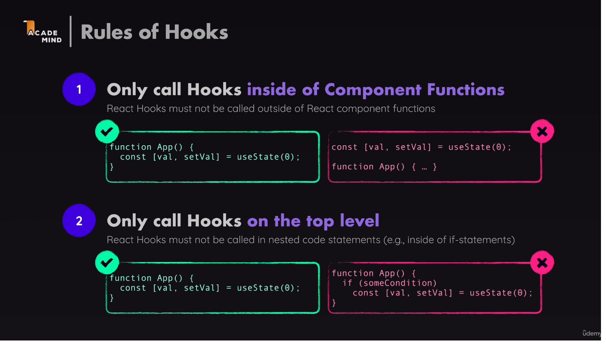
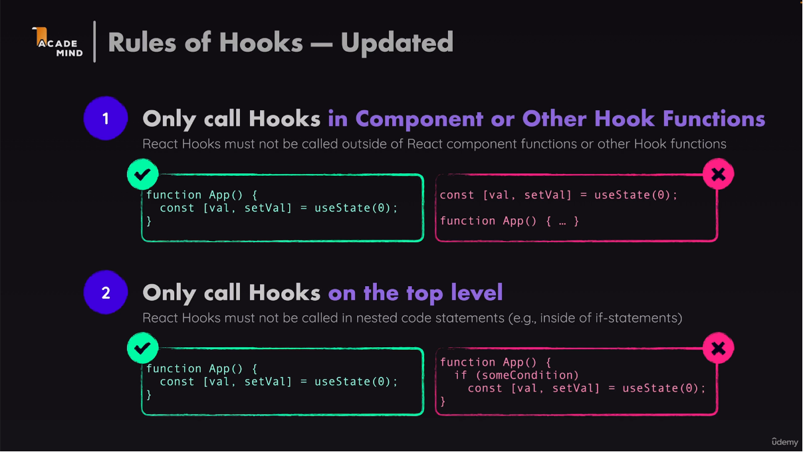

Em um update, as duas funções dispostas em sequência abaixo,
teoricamente teriam um efeito de alternar o valor do state,
porém não é o caso.
OBS: as duas têm a mesma função, muda somente a sintaxe.
// setIsEditing(isEditing ? false : true);
// setIsEditing(!isEditing);

A função abaixo tem o mesmo efeito das acima,
porém, garante o valor do último state
caso haja uma chamada dupla ou simultânea de update
na mesma função.
// setIsEditing((editing)=>!editing);


Lift state up é um recurso do React que permite passar um update
de um component antecessor para um segundo (child) component via props


Ref é um hook que executa uma tarefa similar ao State, porém não
faz o update do componente aplicado em questão. Como vantagem,
ele é capaz de acessar diretamente o DOM do elemento (tag) e APIs.



Somente use Hooks no nível superior.
React Hooks não devem ser chamados fora das funções dos componentes,
bem como em funções aninhadas,loops, if, etc.
Somente use Hooks em componentes ou outros Hooks.


# Descrição: 

fetch (url [, options])
    .then ( response => { Resposta esperada})
    .catch( error => {Erro de resposta inesperada})

**url**: _(uso obrigatório)_ É o endereço para o qual você pretende fazer a requisição.
**options**: _(uso opcional)_ - Esse é um objeto que contem várias opçoes para configurar a requisição. Incluindo metodos HTTP( GET.POST,etc), informaçoes do corpo da requisição etc.
.**then()**: Receber a response que representa a resposta da requisição, quando a promessa fetch é resolvida com sucesso. Podemos usar os diversos métodos do objeto response, como : .json(); .text(); .blob() entre outros para processar o conteudo da resposta no formato desejado.
**catch()**: responsavel por ler a mensagem de erro se a promessa falhar ou ser rejeitada.

# Modelos 
**Exemplo mais comum do uso de fetch**
```
 useEffect(() => {
    fetch("https://api4.binance.com/api/v3/ticker/24hr")
       .then((response) => response.json())
       .then((data) => {
          console.log(data[index]);
          setData(data);
       })
       .catch((err) => {
          console.log(err.message);
       });
 }, []);
```
**Exemplo com uso de axios**
Obs: necessário installar a biblioteca axios.
npm install axios
import axios from 'axios'
```
useEffect(() => {
  axios.get("https://api4.binance.com/api/v3/ticker/24hr")
    .then(response => {
      setData(response.data);
    })
    .catch(error => {
      console.error(error);
    });
}, []);
```
const [data, setData] = useState([]);
const [isLoading, setLoading] = useState();

**Exemplo com início e fim de carregamento (isLoading)**
Obs: este modelo evita o erro de variável undefinid,
pois carrega primeiramente uma mesagem (loading)
```
useEffect(() => {
  const fetchData = async () => {
     try {
      setLoading(true);
      const response = await fetch('https://api.gemini.com/v2/ticker/btcusd');
      const resData = await response.json();
      setData(resData);
      // console.log(resData.bpi.USD.rate);
      // console.log(data.symbol);
     } catch (error) {
       console.log("Error fetching data:", error);
     }
    setLoading(false);
  };
  fetchData();
}, []);
```


###### INFORMAÇÕES IMPORTANTES!! ######

updatedItems.splice(existingCartItemIndex, 1);
updatedItems.filter((item) => item.id !== action.item.id)
a função filter() executa a mesma tarefa da função splice()
porém não remove o último ítem (*necessita mais informações*)
