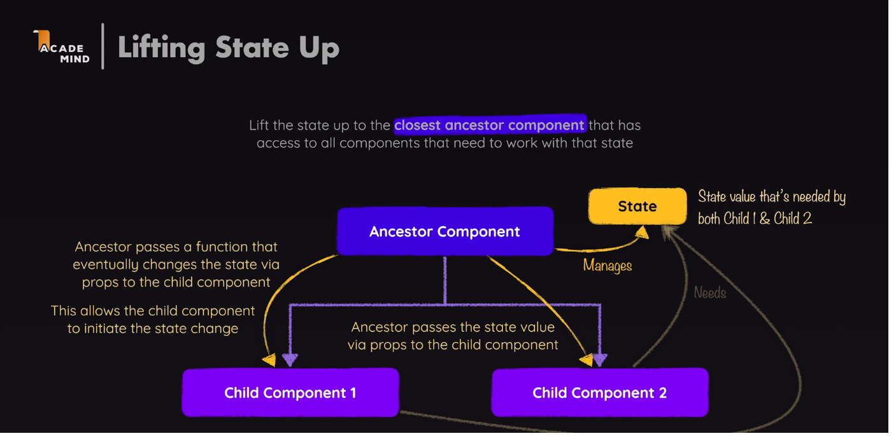

Em um update, as duas funções dispostas em sequência abaixo, 
teoricamente teriam um efeito de alternar o valor do state, 
porém não é o caso.
OBS: as duas têm a mesma função, muda somente a sintaxe.
    // setIsEditing(isEditing ? false : true);
    // setIsEditing(!isEditing);
    
A função abaixo tem o mesmo efeito das acima,
porém, garante o valor do último state 
caso haja uma chamada dupla ou simultânea de update 
na mesma função.
   // setIsEditing((editing)=>!editing);

Lift state up é um recurso do React que permite passar um update
de um component antecessor para um segundo (child) component via props